# MANUAL TÉCNICO
## Proyecto 1: Desarrollo, Conexión y Gestión de Contenedores en Entornos Virtualizados

---

### Información del Estudiante

| Campo | Información |
|-------|-------------|
| **Nombre** | Josué David Velásquez Ixchop |
| **Carnet** | 202307705 |
| **Curso** | Sistemas Operativos 1 |
| **Ciclo** | 1S 2026 |
| **Fecha** | Febrero 2026 |

---

## Tabla de Contenidos

1. [Introducción](#1-introducción)
2. [Objetivos del Sistema](#2-objetivos-del-sistema)
3. [Arquitectura del Sistema](#3-arquitectura-del-sistema)
4. [Diseño de Software](#4-diseño-de-software-backend)
5. [Descripción de Endpoints](#5-descripción-de-endpoints-y-lógica-de-negocio)
6. [Estrategia de Contenerización](#6-estrategia-de-contenerización)
7. [Infraestructura de Despliegue](#7-infraestructura-de-despliegue)
8. [Configuración de Máquinas Virtuales](#8-configuración-de-máquinas-virtuales)
9. [Construcción y Despliegue](#9-construcción-y-despliegue-de-contenedores)
10. [Pruebas y Validación](#10-pruebas-y-validación)
11. [Resolución de Problemas](#11-resolución-de-problemas)
12. [Conclusiones](#12-conclusiones-técnicas)

---

## 1. Introducción

### 1.1 Descripción General

El presente documento técnico detalla la arquitectura, diseño lógico e implementación de una solución de software distribuida basada en microservicios contenerizados. El proyecto simula un entorno de producción real utilizando virtualización a nivel de hardware (KVM) y a nivel de sistema operativo (Contenedores), orquestando la comunicación entre servicios heterogéneos desplegados en múltiples nodos.

### 1.2 Alcance del Proyecto

El sistema implementado comprende:
- **3 Máquinas Virtuales** independientes ejecutándose sobre KVM/QEMU
- **3 APIs REST** desarrolladas en Go (Golang)
- **2 Runtimes de contenedores**: Docker y Containerd
- **1 Registro privado** de imágenes (Zot Registry)
- **Comunicación REST/HTTP** entre servicios con formato JSON

### 1.3 Tecnologías Utilizadas

| Tecnología | Versión | Propósito |
|------------|---------|-----------|
| Go (Golang) | 1.21 | Desarrollo de APIs REST |
| Docker | 24.x | Runtime de contenedores (VM3) |
| Containerd | 1.7.x | Runtime de contenedores (VM1, VM2) |
| Zot Registry | 2.x | Almacenamiento de imágenes |
| KVM/QEMU | - | Virtualización de hardware |
| Alpine Linux | 3.x | Sistema operativo base de contenedores |

El núcleo del desarrollo se centra en la eficiencia y la modularidad, utilizando Go (Golang) para la construcción de las APIs debido a su manejo nativo de la concurrencia y bajo consumo de memoria. La infraestructura se gestiona mediante una combinación híbrida de runtimes: Docker para la gestión de imágenes y registros, y Containerd para la ejecución ligera en los nodos de procesamiento.

---

## 2. Objetivos del Sistema

### 2.1 Objetivos Generales

- Implementar un entorno virtualizado completo que simule infraestructura empresarial real
- Desarrollar APIs REST escalables y mantenibles
- Establecer comunicación confiable entre servicios distribuidos

### 2.2 Objetivos Específicos

1. **Virtualización de Infraestructura**: Implementar una red de Máquinas Virtuales (VMs) interconectadas que simulen un clúster de servidores independientes.

2. **Descentralización de Servicios**: Evitar puntos únicos de fallo mediante la distribución de APIs en diferentes nodos (VM1 y VM2).

3. **Gestión de Artefactos**: Centralizar el almacenamiento de software mediante un registro privado (Zot), simulando un entorno empresarial seguro ("air-gapped").

4. **Interoperabilidad**: Garantizar la comunicación fluida entre microservicios utilizando protocolos estándar (HTTP/REST y JSON).

5. **Tolerancia a Fallos**: Implementar manejo robusto de errores y timeouts en las comunicaciones entre APIs.

6. **Personalización**: Cumplir con los requisitos de nomenclatura y formato específicos del proyecto (carnet en rutas y respuestas).

---

## 3. Arquitectura del Sistema

### 3.1 Topología de Red

El sistema opera sobre una red virtual interna (**192.168.122.0/24**) gestionada por el hipervisor KVM/QEMU. Esta red aísla el tráfico del proyecto, permitiendo una comunicación controlada entre los nodos.

#### Configuración de Nodos

**Nodo Principal (VM1 - 192.168.122.250):**
- **Rol**: Servidor de Aplicaciones Principal
- **Sistema Operativo**: Ubuntu Server 22.04 LTS
- **Runtime**: Containerd 1.7.x
- **Cargas de Trabajo**: 
  - API1 en puerto **8080**
  - API2 en puerto **8081**
- **Recursos**: 2 vCPU, 2GB RAM, 20GB Disco

**Nodo Secundario (VM2 - 192.168.122.246):**
- **Rol**: Servidor de Aplicaciones Auxiliar
- **Sistema Operativo**: Ubuntu Server 22.04 LTS
- **Runtime**: Containerd 1.7.x
- **Cargas de Trabajo**: 
  - API3 en puerto **8080**
- **Recursos**: 2 vCPU, 2GB RAM, 20GB Disco

**Nodo de Infraestructura (VM3 - 192.168.122.141):**
- **Rol**: Repositorio de Imágenes (Registry)
- **Sistema Operativo**: Ubuntu Server 22.04 LTS
- **Runtime**: Docker Engine 24.x
- **Servicios**: 
  - Zot Registry en puerto **5000**
- **Recursos**: 2 vCPU, 2GB RAM, 20GB Disco

### 3.2 Diagrama de Arquitectura
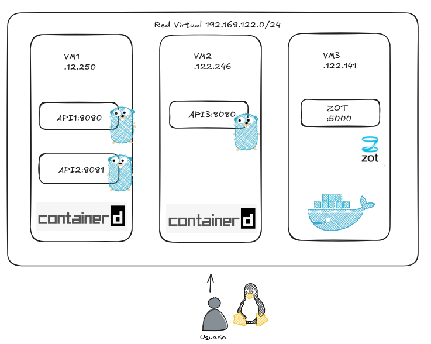
### 3.3 Matriz de Comunicación

| Desde | Hacia | Puerto | Protocolo | Endpoint |
|-------|-------|--------|-----------|----------|
| Cliente | API1 | 8080 | HTTP | `/health`, `/api1/202307705/call-api2`, `/api1/202307705/call-api3` |
| Cliente | API2 | 8081 | HTTP | `/health`, `/api2/202307705/call-api1`, `/api2/202307705/call-api3` |
| Cliente | API3 | 8080 | HTTP | `/health`, `/api3/202307705/call-api1`, `/api3/202307705/call-api2` |
| API1 | API2 | 8081 | HTTP | `/health` |
| API1 | API3 | 8080 | HTTP | `/health` |
| API2 | API1 | 8080 | HTTP | `/health` |
| API2 | API3 | 8080 | HTTP | `/health` |
| API3 | API1 | 8080 | HTTP | `/health` |
| API3 | API2 | 8081 | HTTP | `/health` |
| VMs | Zot | 5000 | HTTP | Pull/Push de imágenes |

---

## 4. Diseño de Software (Backend)

### 4.1 Estrategia de Código Unificado

Para optimizar el mantenimiento y asegurar la consistencia lógica, se optó por un enfoque de **"Single Source Code"**. Un único archivo ([main.go](main.go)) contiene la lógica de las tres APIs. El comportamiento específico de cada instancia se determina en tiempo de ejecución mediante inyección de dependencias por argumentos (flags).

#### Ventajas de este diseño:

 **Reducción de Deuda Técnica**: Cualquier corrección de errores (bugfix) se aplica automáticamente a las tres APIs.

 **Portabilidad**: La misma imagen de contenedor puede comportarse como API1, API2 o API3 según se configure al desplegar.

 **Mantenimiento Simplificado**: Un solo archivo de código fuente para actualizar y versionar.

**Consistencia**: Garantiza que todas las APIs respondan con el mismo formato y estructura.

### 4.2 Estructuras de Datos (Modelos)

Se definieron estructuras estrictas en Go para garantizar que la serialización JSON cumpla con los requerimientos del contrato de interfaz especificado en el enunciado.

#### Modelo HealthResponse

Utilizada por el endpoint `/health`:

```go
// Estructura para el endpoint /health
type HealthResponse struct {
    Status    string `json:"status"`    // Siempre "UP"
    Message   string `json:"message"`   // Ej: "API1 is Ready"
    Timestamp string `json:"timestamp"` // Fecha/Hora dinámica (formato ISO)
    VM        string `json:"VM"`        // Hostname del servidor
    Carnet    string `json:"carnet"`    // 202307705
}
```

**Ejemplo de respuesta JSON:**
```json
{
    "status": "UP",
    "message": "API1 is Ready",
    "timestamp": "2026-02-03T10:30:00Z",
    "VM": "vm1-ubuntu",
    "carnet": "202307705"
}
```

#### Modelo CallResponse

Utilizada por los endpoints de comunicación cruzada:

```go
// Estructura para el endpoint de comunicación cruzada
type CallResponse struct {
    ApiName    string `json:"apiname"`    // Nombre de la API consultada
    Message    string `json:"message"`    // Mensaje descriptivo del estado
    Connection bool   `json:"connection"` // true = éxito, false = error
    Carnet     string `json:"carnet"`     // 202307705
}
```

**Ejemplo de respuesta exitosa:**
```json
{
    "apiname": "API1",
    "message": "The API1 located on the VM1 is working",
    "connection": true,
    "carnet": "202307705"
}
```

**Ejemplo de respuesta con error:**
```json
{
    "apiname": "API3",
    "message": "ERROR: The API3 located on the VM2 is not working",
    "connection": false,
    "carnet": "202307705"
}
```

### 4.3 Mapa de Rutas y Configuración (Service Discovery)

El sistema utiliza un **mapa estático** (`apiMap`) para la resolución de direcciones. Esto elimina la necesidad de un servidor DNS complejo para este alcance del proyecto.

```go
var apiMap = map[string]string{
    "API1": "http://192.168.122.250:8080", // VM1 - Puerto 8080
    "API2": "http://192.168.122.250:8081", // VM1 - Puerto 8081
    "API3": "http://192.168.122.246:8080", // VM2 - Puerto 8080
}
```

Este diccionario permite que cada API conozca la ubicación de las demás sin necesidad de configuración externa.

### 4.4 Parámetros de Configuración

Cada contenedor se inicializa con parámetros específicos:

```bash
# Ejemplo de ejecución de API1
./servidor-api -name API1 -port 8080

# Ejemplo de ejecución de API2
./servidor-api -name API2 -port 8081

# Ejemplo de ejecución de API3
./servidor-api -name API3 -port 8080
```

**Parámetros disponibles:**
- `-name`: Nombre de la API (API1, API2, o API3) - **Obligatorio**
- `-port`: Puerto donde escuchará el servidor - **Default: 8080**

### 4.5 Constantes del Sistema

```go
const MyCarnet = "202307705" // Carnet del estudiante
```

Esta constante se utiliza en todas las respuestas JSON para cumplir con los requisitos de personalización del proyecto.

---

## 5. Descripción de Endpoints y Lógica de Negocio

### 5.1 Endpoint de Salud: `GET /health`

Este endpoint funciona como un **heartbeat** del sistema, permitiendo verificar el estado operacional de cada API.

#### Lógica de Funcionamiento

1. **Captura de Información**: Al recibir la petición, el servidor obtiene:
   - Hostname del sistema operativo (identifica si es VM1 o VM2)
   - Timestamp actual en formato ISO
   - Estado fijo "UP" (indica que la API está operativa)

2. **Construcción de Respuesta**: Serializa la estructura `HealthResponse` a JSON

3. **Retorno**: Envía el objeto JSON con código HTTP 200

#### Implementación en Go

```go
func handleHealth(w http.ResponseWriter, r *http.Request) {
    resp := HealthResponse{
        Status:    "UP",
        Message:   currentAPI + " is Ready",
        Timestamp: time.Now().Format("2006-01-02 15:04:05"), 
        VM:        currentVM,
        Carnet:    MyCarnet,
    }
    w.Header().Set("Content-Type", "application/json")
    json.NewEncoder(w).Encode(resp)
}
```

#### Ejemplo de Uso

**Request:**
```http
GET http://192.168.122.250:8080/health
```

**Response (200 OK):**
```json
{
    "status": "UP",
    "message": "API1 is Ready",
    "timestamp": "2026-02-03 10:30:00",
    "VM": "vm1-ubuntu",
    "carnet": "202307705"
}
```

### 5.2 Endpoints de Llamada Cruzada

Estos endpoints implementan la lógica de **cliente HTTP dentro del servidor**, permitiendo que las APIs se comuniquen entre sí.

#### Formato de URL

```
GET /api{N}/{CARNET}/call-api{M}
```

Donde:
- `{N}`: Número de la API actual (1, 2 o 3)
- `{CARNET}`: Número de carnet del estudiante (202307705)
- `{M}`: Número de la API a consultar (1, 2 o 3)

#### Endpoints Disponibles

| API | Endpoint 1 | Endpoint 2 |
|-----|------------|------------|
| **API1** | `/api1/202307705/call-api2` | `/api1/202307705/call-api3` |
| **API2** | `/api2/202307705/call-api1` | `/api2/202307705/call-api3` |
| **API3** | `/api3/202307705/call-api1` | `/api3/202307705/call-api2` |

#### Flujo de Ejecución Detallado
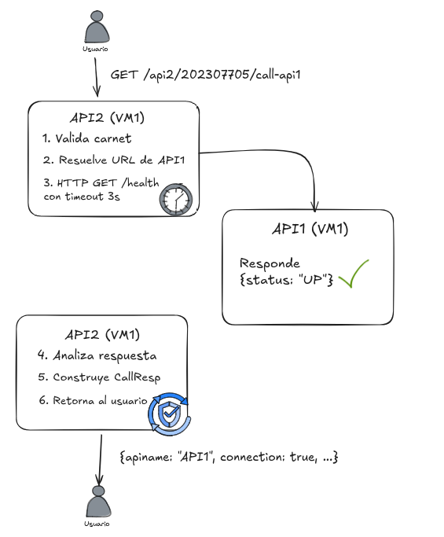

#### Lógica de Implementación

**Paso 1: Validación del Carnet**
```go
if !strings.Contains(path, "/"+MyCarnet+"/") {
    http.Error(w, "Carnet inválido", http.StatusBadRequest)
    return
}
```

**Paso 2: Resolución de la API Destino**
```go
targetName := "API1" // Extraído de la URL
targetURL, exists := apiMap[targetName]
if !exists {
    // API no encontrada en el mapa
}
```

**Paso 3: Petición HTTP con Timeout**
```go
client := &http.Client{
    Timeout: 3 * time.Second, // Timeout de 3 segundos
}
resp, err := client.Get(targetURL + "/health")
```

**Paso 4: Manejo de Respuesta**

Caso Éxito (API disponible):
```go
if err == nil && resp.StatusCode == 200 {
    var health HealthResponse
    json.NewDecoder(resp.Body).Decode(&health)
    
    if health.Status == "UP" {
        callResp := CallResponse{
            ApiName:    targetName,
            Message:    fmt.Sprintf("The %s located on the VM%s is working", ...),
            Connection: true,
            Carnet:     MyCarnet,
        }
        // Retornar callResp
    }
}
```

Caso Error (API no disponible):
```go
if err != nil {
    callResp := CallResponse{
        ApiName:    targetName,
        Message:    fmt.Sprintf("ERROR: The %s located on the VM%s is not working", ...),
        Connection: false,
        Carnet:     MyCarnet,
    }
    // Retornar callResp
}
```

#### Ejemplo Completo: API2 consulta a API1

**Request del Usuario:**
```http
GET http://192.168.122.250:8081/api2/202307705/call-api1
```

**Petición Interna de API2 a API1:**
```http
GET http://192.168.122.250:8080/health
```

**Respuesta de API1:**
```json
{
    "status": "UP",
    "message": "API1 is Ready",
    "timestamp": "2026-02-03T10:30:00Z",
    "VM": "vm1-ubuntu",
    "carnet": "202307705"
}
```

**Respuesta Final al Usuario (200 OK):**
```json
{
    "apiname": "API1",
    "message": "The API1 located on the VM1 is working",
    "connection": true,
    "carnet": "202307705"
}
```

#### Manejo de Errores

**Escenario 1: Timeout de Red**
```json
{
    "apiname": "API3",
    "message": "ERROR: The API3 located on the VM2 is not working",
    "connection": false,
    "carnet": "202307705"
}
```

**Escenario 2: Carnet Incorrecto en URL**
```
HTTP 400 Bad Request
"Carnet inválido"
```

**Escenario 3: API no existe en el mapa**
```
HTTP 404 Not Found
```

### 5.3 Router Principal

El sistema utiliza un router simple basado en análisis de rutas:

```go
func router(w http.ResponseWriter, r *http.Request) {
    path := r.URL.Path

    // 1. Endpoint /health 
    if path == "/health" {
        handleHealth(w, r)
        return
    }

    // 2. Endpoint de llamadas 
    if strings.Contains(path, "/call-api") {
        handleCall(w, r)
        return
    }

    // 3. Ruta no encontrada
    http.NotFound(w, r)
}
```

---

## 6. Estrategia de Contenerización

### 6.1 Dockerfile

Se utilizó una **imagen base ligera** (`golang:1.21-alpine`) para minimizar la superficie de ataque y el tamaño final del artefacto.

#### Contenido del Dockerfile

```dockerfile
# Imagen base oficial de Go con Alpine Linux
FROM golang:1.21-alpine

# Establecer directorio de trabajo
WORKDIR /app

# Copiar código fuente
COPY main.go .

# Compilación estática del binario
# -o especifica el nombre del archivo de salida
RUN go build -o servidor-api main.go

# Punto de entrada que acepta argumentos
# Permite pasar flags -name y -port al iniciar el contenedor
ENTRYPOINT ["./servidor-api"]
```


### 6.2 Personalización y Versionado

Cumpliendo con los requisitos de la rúbrica, las imágenes fueron generadas con una nomenclatura específica que vincula el artefacto al estudiante.

#### Nomenclatura de Imágenes

**Formato:** `[nombre-api]-[carnet]:[tag]`

**Ejemplos:**
```bash
192.168.122.141:5000/api1-202307705:latest
192.168.122.141:5000/api2-202307705:latest
192.168.122.141:5000/api3-202307705:latest
```

**Donde:**
- `192.168.122.141:5000`: Dirección del registro privado (Zot)
- `api1-202307705`: Nombre de la imagen (API + carnet)
- `latest`: Tag de versión

### 6.3 Construcción de Imágenes

**Comando de construcción:**
```bash
# Para API1
docker build -t 192.168.122.141:5000/api1-202307705:latest .

# Para API2
docker build -t 192.168.122.141:5000/api2-202307705:latest .

# Para API3
docker build -t 192.168.122.141:5000/api3-202307705:latest .
```

**Nota:** Aunque usamos el mismo Dockerfile, etiquetamos con nombres diferentes para cumplir con los requisitos del proyecto. La diferenciación funcional se logra mediante los argumentos de ejecución.


## 7. Infraestructura de Despliegue


#### VM3 (Docker)

Se utiliza por su facilidad para gestionar volúmenes y redes complejas requeridas por el registro Zot.

**Comandos utilizados:**
```bash
# Ejecutar Zot Registry
docker run -d \
  --name zot-registry \
  -p 5000:5000 \
  -v /var/lib/zot:/var/lib/registry \
  ghcr.io/project-zot/zot-linux-amd64:latest

# Verificar estado
docker ps

# Ver logs
docker logs zot-registry
```

#### VM1 y VM2 (Containerd)

Se utiliza `ctr` (herramienta de línea de comandos de Containerd) para demostrar un manejo de bajo nivel de los contenedores, optimizando recursos en los nodos de trabajo.

**Comandos utilizados:**

```bash
# Descargar imagen desde Zot
ctr images pull --plain-http 192.168.122.141:5000/api1-202307705:latest

# Listar imágenes
ctr images list

# Ejecutar contenedor API1 en VM1
ctr run -d \
  --net-host \
  192.168.122.141:5000/api1-202307705:latest \
  api1-container \
  /app/servidor-api -name API1 -port 8080

# Ejecutar contenedor API2 en VM1
ctr run -d \
  --net-host \
  192.168.122.141:5000/api2-202307705:latest \
  api2-container \
  /app/servidor-api -name API2 -port 8081

# Ejecutar contenedor API3 en VM2
ctr run -d \
  --net-host \
  192.168.122.141:5000/api3-202307705:latest \
  api3-container \
  /app/servidor-api -name API3 -port 8080

# Listar contenedores en ejecución
ctr containers list

# Verificar tareas activas
ctr tasks list

# Ver logs de un contenedor
ctr tasks exec --exec-id bash api1-container sh
```

### 7.2 Almacenamiento y Distribución (Zot Registry)

Para simular un ciclo de vida DevOps real, las imágenes no se transfieren manualmente. Se implementó un flujo **Push/Pull** estándar de la industria.

#### Flujo de Distribución de Imágenes
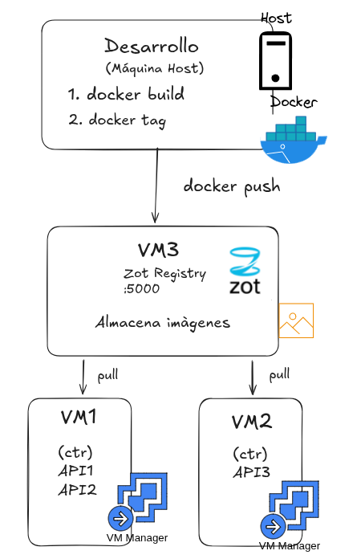

#### Configuración de Zot Registry

**Archivo de configuración (config.json):**
```json
{
  "storage": {
    "rootDirectory": "/var/lib/registry"
  },
  "http": {
    "address": "0.0.0.0",
    "port": "5000"
  },
  "log": {
    "level": "debug"
  }
}
```

**Ejecución de Zot:**
```bash
docker run -d \
  --name zot-registry \
  -p 5000:5000 \
  -v $(pwd)/config.json:/etc/zot/config.json \
  -v /var/lib/zot:/var/lib/registry \
  ghcr.io/project-zot/zot-linux-amd64:latest \
  serve /etc/zot/config.json
```

#### Operaciones con el Registry

**Push de imágenes (desde máquina de desarrollo):**
```bash
# Tag de la imagen con la dirección del registry
docker tag api1-202307705:latest 192.168.122.141:5000/api1-202307705:latest

# Push al registry
docker push 192.168.122.141:5000/api1-202307705:latest
```

**Pull de imágenes (en VMs de producción):**
```bash
# En VM1 o VM2 con Containerd
ctr images pull --plain-http 192.168.122.141:5000/api1-202307705:latest

# Verificar la imagen descargada
ctr images list | grep api1
```

**Listar imágenes en el registry:**
```bash
# Desde cualquier VM
curl http://192.168.122.141:5000/v2/_catalog

# Respuesta:
# {"repositories":["api1-202307705","api2-202307705","api3-202307705"]}
```

### 7.3 Persistencia de Datos

**Volúmenes utilizados:**

| VM | Path Host | Path Contenedor | Propósito |
|----|-----------|-----------------|-----------|
| VM3 | `/var/lib/zot` | `/var/lib/registry` | Almacenamiento de imágenes |


---

---

## 8. Configuración de Máquinas Virtuales

Esta sección detalla la configuración completa de cada VM según lo solicitado en el enunciado.

### 8.1 Requisitos del Hipervisor


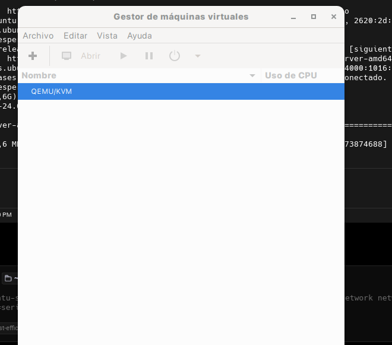
**Software necesario en el host:**
```bash
# Instalación de KVM/QEMU en Ubuntu
sudo apt update
sudo apt install qemu-kvm libvirt-daemon-system libvirt-clients bridge-utils virt-manager


# Verificar soporte de virtualización
egrep -c '(vmx|svm)' /proc/cpuinfo  # Debe ser > 0

# Iniciar servicio libvirt
sudo systemctl enable libvirtd
sudo systemctl start libvirtd
```

### 8.2 Creación de las Máquinas Virtuales

#### VM1 - Servidor de Aplicaciones Principal

## PASOS PARA CONFIGURAR LAS VMS
Como simplificaciòn propia se propuso configurar 1 vm y luego clonar las otras 2 
 

1. se mostrara una ventana emergente la cual es el paso de Actualizaciòn del instalador disponible
le daremos continuar sin actualizar
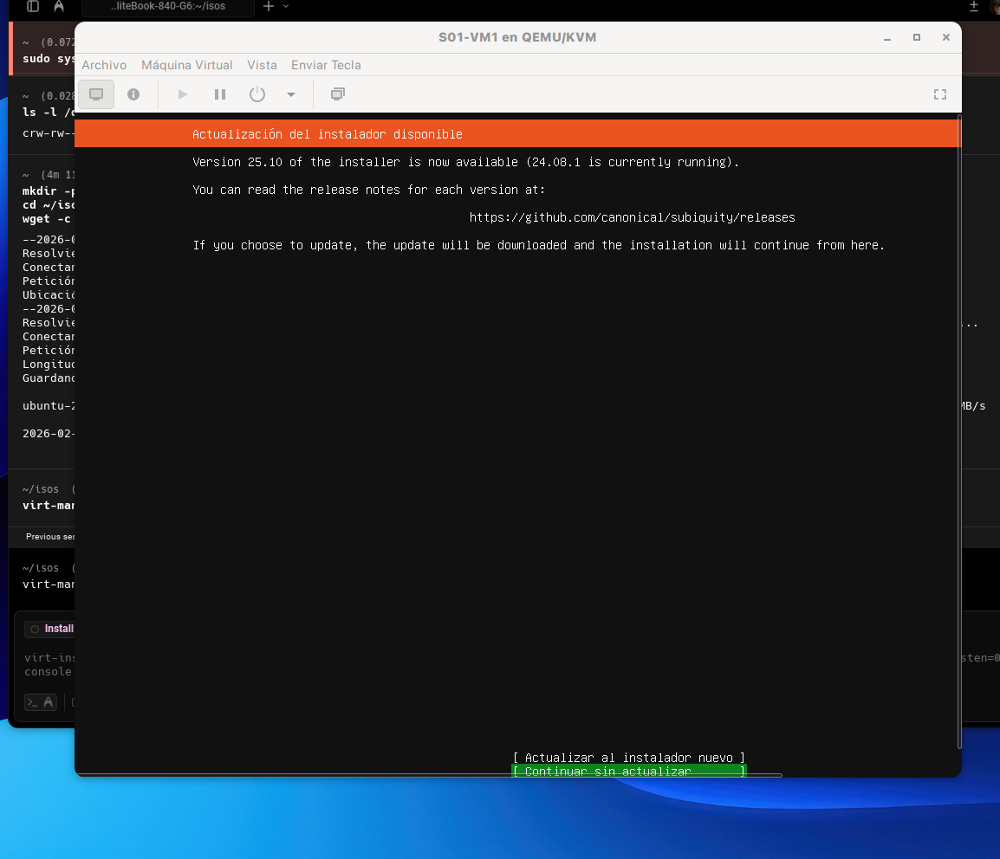
2. luego de eso seguira el ubuntu archive mirror configuration ahì simplemente le daremos en Hecho
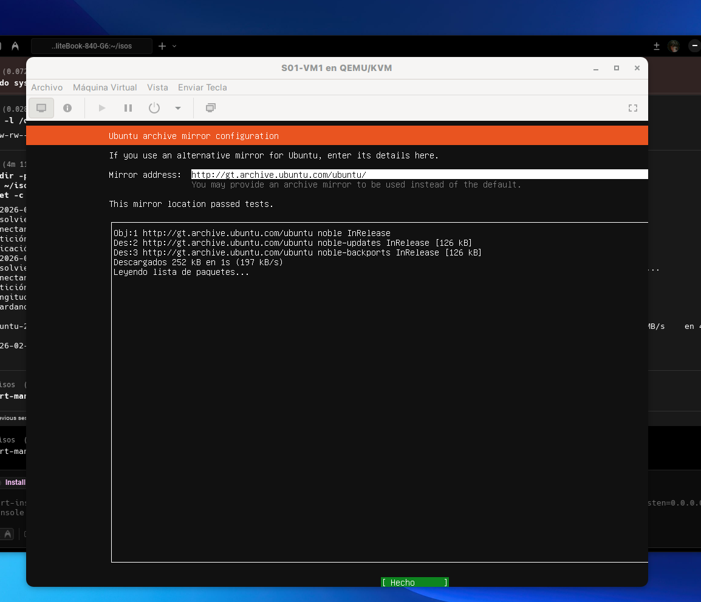
3. luego se desplegara el guide storage configuration dejaremos marcalo la parte de USE AN ENTIRE DISK con un tamaño de 20 G y le damos hecho
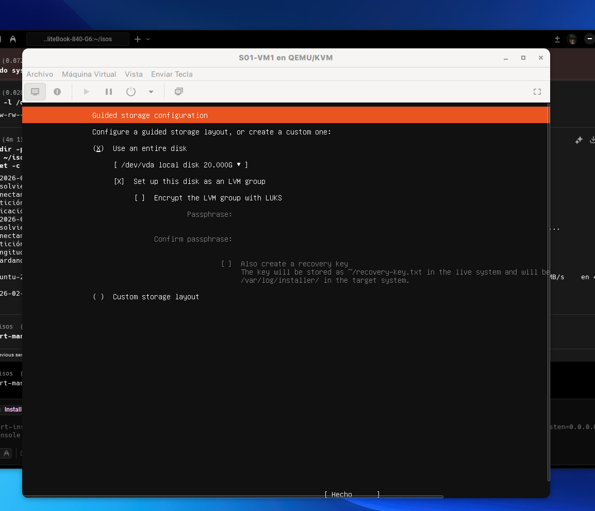
4. luego en el Storage configuration solo le daremos hecho ya que es un resumen de lo agregado anteriormente 
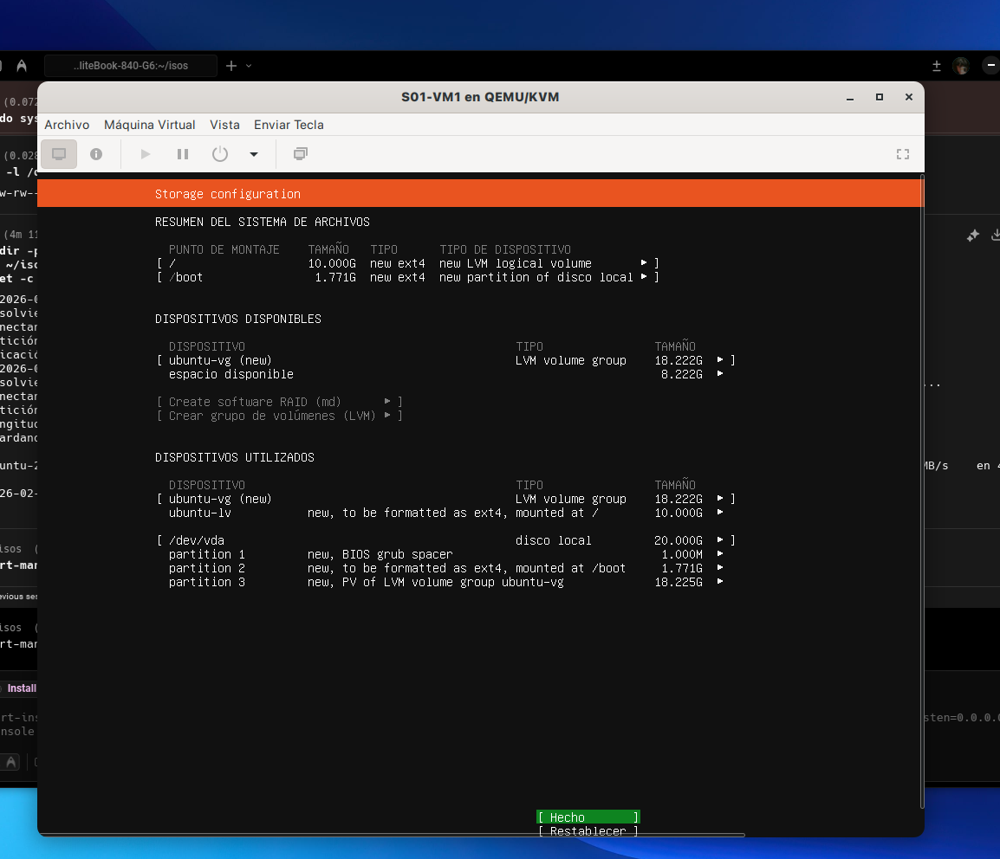
5. en Upgrade to Ubuntu Pro solo le daremos skip ya que no es necesario para este proyecto las funciones pro de ubuntu
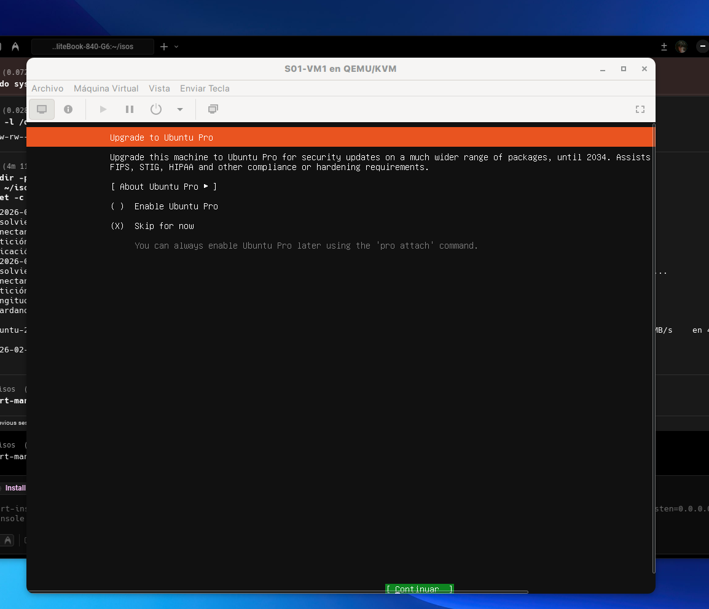
6. y asì se verìa la instacion completa pedira reiniciar 
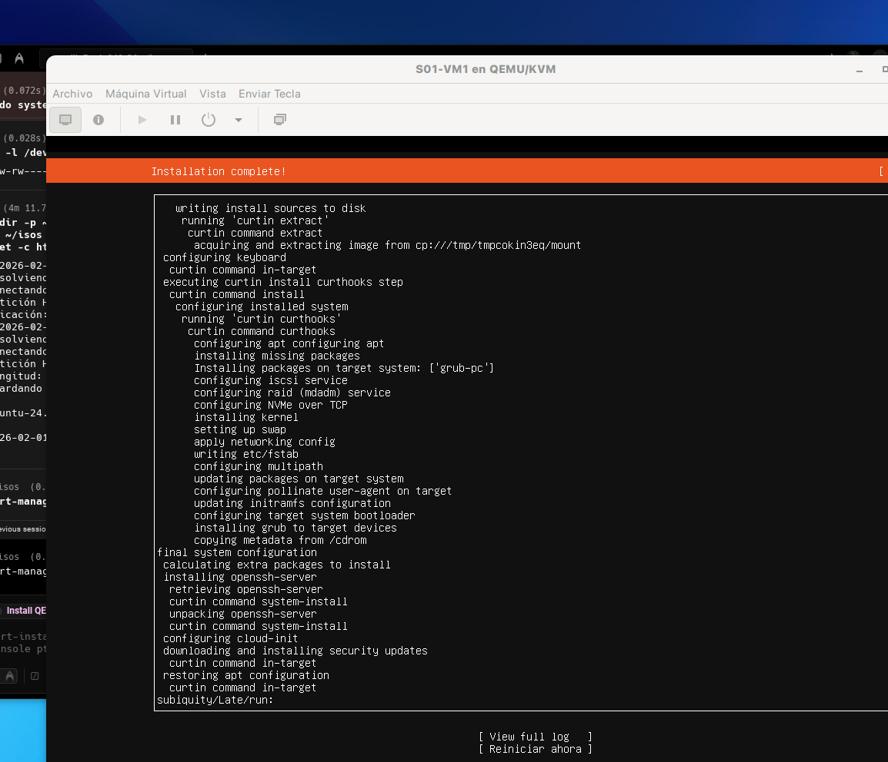
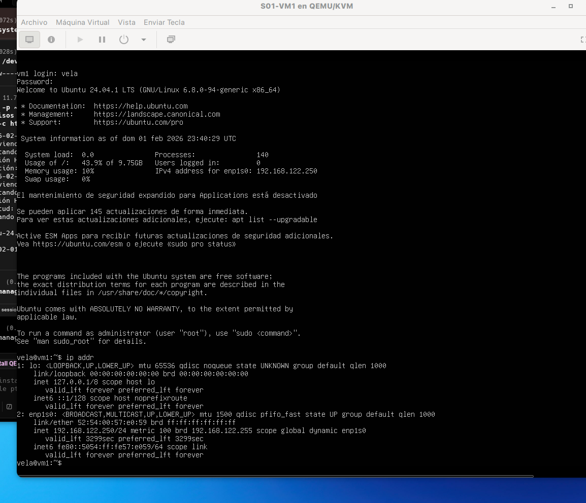
7. por ultimo veremos en nuestra interfaz las vms creadas :D

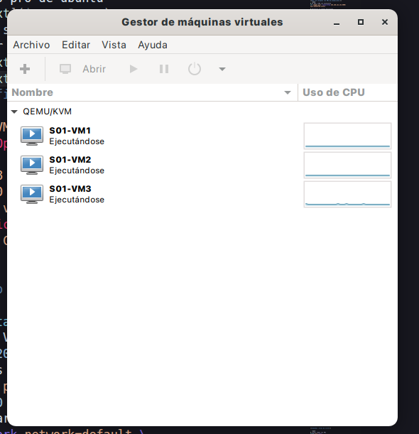

8. para las demas vms solo las clonamos 
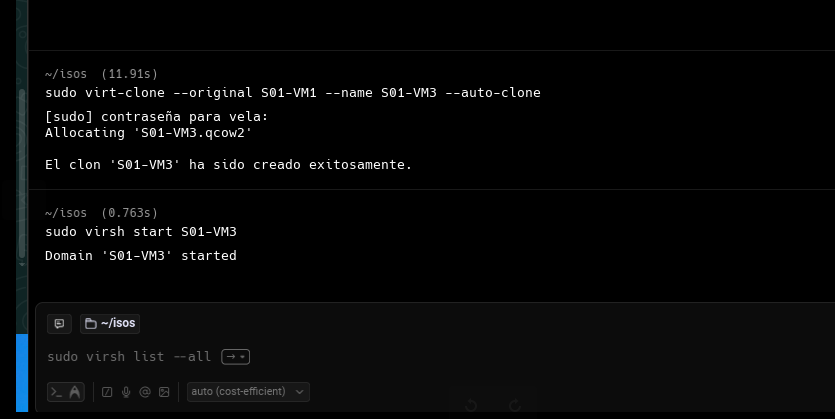
9. para una mejor utilizaciòn de las vms nos conectaremos por medio de ssh
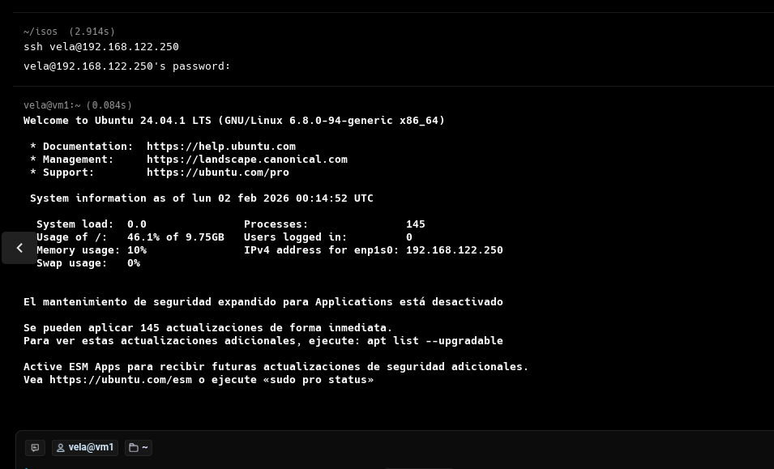

10. instalaremos go en la vm1 y vm2
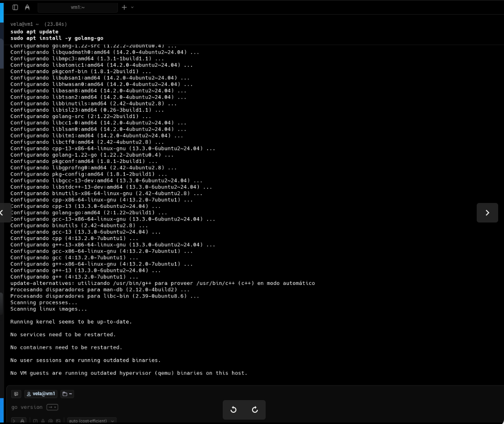

11. clonaremos y entraremos y compilamos el main.go 
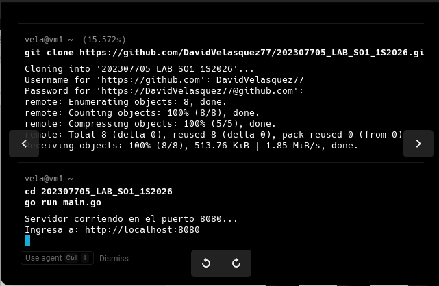

12. compilamos y creamos los servicios 
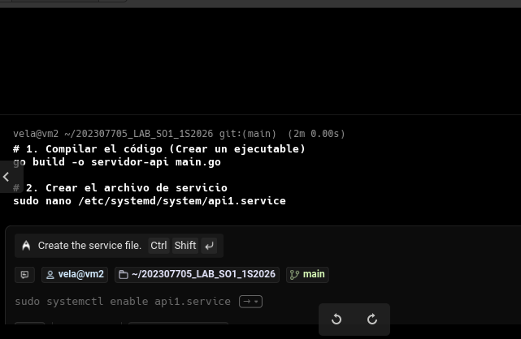

13. verificamos que esta activa el servicio de la api
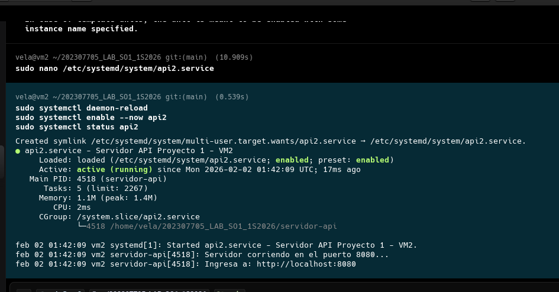

**Especificaciones:**
```yaml
Nombre: VM1-SOPES1-API
Sistema Operativo: Ubuntu Server 22.04 LTS
vCPUs: 2
RAM: 2048 MB
Disco: 20 GB (qcow2)
Red: Red virtual default (192.168.122.0/24)
IP Estática: 192.168.122.250
Runtime: Containerd 1.7.x
```


**Configuración de red (netplan):**
```yaml
# /etc/netplan/00-installer-config.yaml
network:
  version: 2
  ethernets:
    enp1s0:
      addresses:
        - 192.168.122.250/24
      gateway4: 192.168.122.1
      nameservers:
        addresses:
          - 8.8.8.8
          - 8.8.4.4
```

**Instalación de Containerd:**
```bash
# Actualizar sistema
sudo apt update && sudo apt upgrade -y

# Instalar dependencias
sudo apt install -y apt-transport-https ca-certificates curl software-properties-common

# Instalar Containerd
sudo apt install -y containerd

# Configurar Containerd
sudo mkdir -p /etc/containerd
containerd config default | sudo tee /etc/containerd/config.toml

# Reiniciar servicio
sudo systemctl restart containerd
sudo systemctl enable containerd

# Verificar instalación
ctr version
```

#### VM2 - Servidor de Aplicaciones Auxiliar

**Especificaciones:**
```yaml
Nombre: VM2-SOPES1-API
Sistema Operativo: Ubuntu Server 22.04 LTS
vCPUs: 2
RAM: 2048 MB
Disco: 20 GB (qcow2)
Red: Red virtual default (192.168.122.0/24)
IP Estática: 192.168.122.246
Runtime: Containerd 1.7.x
```


**Configuración de red (netplan):**
```yaml
# /etc/netplan/00-installer-config.yaml
network:
  version: 2
  ethernets:
    enp1s0:
      addresses:
        - 192.168.122.246/24
      gateway4: 192.168.122.1
      nameservers:
        addresses:
          - 8.8.8.8
          - 8.8.4.4
```

**Instalación de Containerd:** (Mismo procedimiento que VM1)

#### VM3 - Servidor de Registro (Zot)

**Especificaciones:**
```yaml
Nombre: VM3-SOPES1-ZOT
Sistema Operativo: Ubuntu Server 22.04 LTS
vCPUs: 2
RAM: 2048 MB
Disco: 20 GB (qcow2)
Red: Red virtual default (192.168.122.0/24)
IP Estática: 192.168.122.141
Runtime: Docker Engine 24.x
```

**Comando de creación:**
```bash
virt-install \
  --name VM3-SOPES1-ZOT \
  --ram 2048 \
  --vcpus 2 \
  --disk path=/var/lib/libvirt/images/vm3.qcow2,size=20 \
  --os-variant ubuntu22.04 \
  --network network=default \
  --graphics none \
  --console pty,target_type=serial \
  --location 'http://archive.ubuntu.com/ubuntu/dists/jammy/main/installer-amd64/' \
  --extra-args 'console=ttyS0,115200n8 serial'
```

**Configuración de red (netplan):**
```yaml
# /etc/netplan/00-installer-config.yaml
network:
  version: 2
  ethernets:
    enp1s0:
      addresses:
        - 192.168.122.141/24
      gateway4: 192.168.122.1
      nameservers:
        addresses:
          - 8.8.8.8
          - 8.8.4.4
```
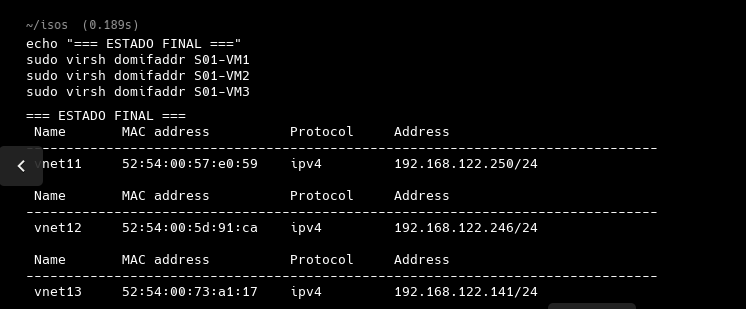
**Instalación de Docker:**
```bash
# Actualizar sistema
sudo apt update && sudo apt upgrade -y

# Instalar dependencias
sudo apt install -y apt-transport-https ca-certificates curl gnupg lsb-release

# Agregar clave GPG de Docker
curl -fsSL https://download.docker.com/linux/ubuntu/gpg | sudo gpg --dearmor -o /usr/share/keyrings/docker-archive-keyring.gpg

# Agregar repositorio de Docker
echo "deb [arch=$(dpkg --print-architecture) signed-by=/usr/share/keyrings/docker-archive-keyring.gpg] https://download.docker.com/linux/ubuntu $(lsb_release -cs) stable" | sudo tee /etc/apt/sources.list.d/docker.list > /dev/null

# Instalar Docker
sudo apt update
sudo apt install -y docker-ce docker-ce-cli containerd.io docker-buildx-plugin docker-compose-plugin

# Habilitar servicio
sudo systemctl enable docker
sudo systemctl start docker

# Agregar usuario al grupo docker
sudo usermod -aG docker $USER

# Verificar instalación
docker --version
docker run hello-world
```
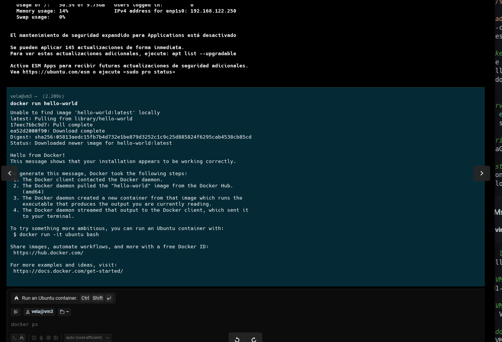
### 8.3 Gestión de VMs

**Comandos útiles de virsh:**

```bash
# Listar todas las VMs
virsh list --all

# Iniciar una VM
virsh start VM1-SOPES1-API

# Detener una VM
virsh shutdown VM1-SOPES1-API

# Forzar apagado
virsh destroy VM1-SOPES1-API

# Conectar a consola
virsh console VM1-SOPES1-API

# Ver información de la VM
virsh dominfo VM1-SOPES1-API

# Autostart al iniciar el sistema
virsh autostart VM1-SOPES1-API

# Eliminar VM
virsh undefine VM1-SOPES1-API --remove-all-storage
```

### 8.4 Verificación de Conectividad

**Desde el host:**
```bash
# Ping a las VMs
ping -c 3 192.168.122.250  # VM1
ping -c 3 192.168.122.246  # VM2
ping -c 3 192.168.122.141  # VM3

# Verificar puertos abiertos
nmap 192.168.122.250 -p 8080,8081
nmap 192.168.122.246 -p 8080
nmap 192.168.122.141 -p 5000
```

**Entre VMs:**
```bash
# Desde VM1
ping -c 3 192.168.122.246  # VM2
ping -c 3 192.168.122.141  # VM3

# Verificar acceso al registry
curl http://192.168.122.141:5000/v2/_catalog
```

---

## 9. Construcción y Despliegue de Contenedores

### 9.1 Preparación del Código

**Estructura del proyecto:**
```
PROYECTO1/
├── Dockerfile
├── main.go
├── go.mod
├── ManualTecnico.md
└── Guía de Instalación.md
```

**Inicialización del módulo Go:**
```bash
# Crear go.mod si no existe
go mod init proyecto1-sopes1
```

### 9.2 Construcción de Imágenes

**En la máquina de desarrollo o VM3:**

```bash
# Construir imagen base
docker build -t api-base:latest .

# Etiquetar para cada API
docker tag api-base:latest 192.168.122.141:5000/api1-202307705:latest
docker tag api-base:latest 192.168.122.141:5000/api2-202307705:latest
docker tag api-base:latest 192.168.122.141:5000/api3-202307705:latest

# Verificar imágenes creadas
docker images | grep 202307705
```

**Output esperado:**
```
192.168.122.141:5000/api1-202307705   latest   abc123def456   2 minutes ago   310MB
192.168.122.141:5000/api2-202307705   latest   abc123def456   2 minutes ago   310MB
192.168.122.141:5000/api3-202307705   latest   abc123def456   2 minutes ago   310MB
```

### 9.3 Push al Registro Zot

**Configurar insecure registry (si es necesario):**
```bash
# Editar /etc/docker/daemon.json
sudo nano /etc/docker/daemon.json
```

```json
{
  "insecure-registries": ["192.168.122.141:5000"]
}
```

```bash
# Reiniciar Docker
sudo systemctl restart docker
```

**Push de imágenes:**
```bash
docker push 192.168.122.141:5000/api1-202307705:latest
docker push 192.168.122.141:5000/api2-202307705:latest
docker push 192.168.122.141:5000/api3-202307705:latest
```

**Verificar en Zot:**
```bash
curl http://192.168.122.141:5000/v2/_catalog
# Output: {"repositories":["api1-202307705","api2-202307705","api3-202307705"]}

curl http://192.168.122.141:5000/v2/api1-202307705/tags/list
# Output: {"name":"api1-202307705","tags":["latest"]}
```

### 9.4 Despliegue en VM1 (Containerd)

**Pull de imágenes:**
```bash
# Configurar insecure registry para containerd
sudo nano /etc/containerd/config.toml
```

Agregar:
```toml
[plugins."io.containerd.grpc.v1.cri".registry.mirrors."192.168.122.141:5000"]
  endpoint = ["http://192.168.122.141:5000"]

[plugins."io.containerd.grpc.v1.cri".registry.configs."192.168.122.141:5000".tls]
  insecure_skip_verify = true
```

```bash
# Reiniciar containerd
sudo systemctl restart containerd

# Pull de imágenes
sudo ctr images pull --plain-http 192.168.122.141:5000/api1-202307705:latest
sudo ctr images pull --plain-http 192.168.122.141:5000/api2-202307705:latest

# Verificar
sudo ctr images list | grep 202307705
```

**Ejecutar contenedores:**
```bash
# API1 en puerto 8080
sudo ctr run -d \
  --net-host \
  192.168.122.141:5000/api1-202307705:latest \
  api1-container \
  /app/servidor-api -name API1 -port 8080

# API2 en puerto 8081
sudo ctr run -d \
  --net-host \
  192.168.122.141:5000/api2-202307705:latest \
  api2-container \
  /app/servidor-api -name API2 -port 8081

# Verificar contenedores en ejecución
sudo ctr tasks list
```

### 9.5 Despliegue en VM2 (Containerd)

**Pull y ejecución:**
```bash
# Pull de imagen
sudo ctr images pull --plain-http 192.168.122.141:5000/api3-202307705:latest

# Ejecutar API3
sudo ctr run -d \
  --net-host \
  192.168.122.141:5000/api3-202307705:latest \
  api3-container \
  /app/servidor-api -name API3 -port 8080

# Verificar
sudo ctr tasks list
```

### 9.6 Verificación de Servicios

**Comprobar que las APIs están respondiendo:**

```bash
# Desde cualquier VM o el host
curl http://192.168.122.250:8080/health  # API1
curl http://192.168.122.250:8081/health  # API2
curl http://192.168.122.246:8080/health  # API3
```

**Output esperado (ejemplo API1):**
```json
{
  "status": "UP",
  "message": "API1 is Ready",
  "timestamp": "2026-02-03 10:30:00",
  "VM": "vm1-ubuntu",
  "carnet": "202307705"
}
```

---

## 10. GUÍA DE EVIDENCIA FUNCIONAL

Requisito previo: Ten abiertas tus 4 terminales (PC Host, VM1, VM2, VM3).

1. EVIDENCIA DE INFRAESTRUCTURA (KVM)
Demuestra que tienes las 3 VMs con sus IPs.
Terminal: PC Host (Tu compu)
Comando:
```bash
sudo virsh domifaddr S01-VM1 && sudo virsh domifaddr S01-VM2 && sudo virsh domifaddr S01-VM3
```
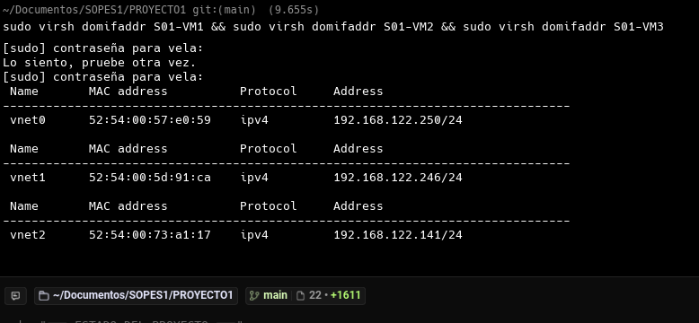

2. EVIDENCIA DE CONSTRUCCIÓN (Build)

Demuestra que creaste las imágenes con tu carnet.

Terminal: PC Host

Comando:

```bash
docker images | grep 202307705
```
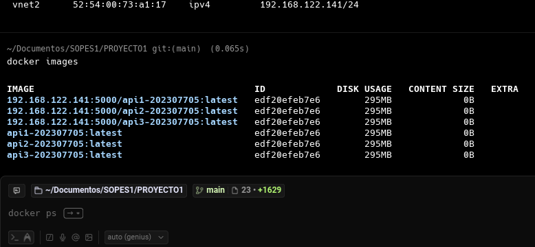

3. EVIDENCIA DE REGISTRO (Zot Catalog)
Demuestra que las imágenes están subidas en el servidor central (VM3).

Terminal: PC Host (o cualquiera)

Comando:
```bash
curl http://192.168.122.141:5000/v2/_catalog
```
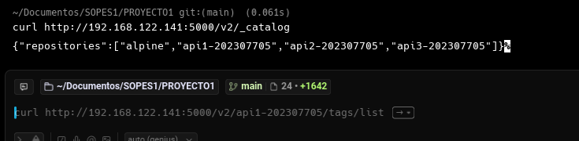

4. EVIDENCIA DE DESPLIEGUE (Containerd Running)
Demuestra que los contenedores están corriendo en los nodos de trabajo.

Terminal: VM1

Comando:
```bash
sudo ctr containers list
```
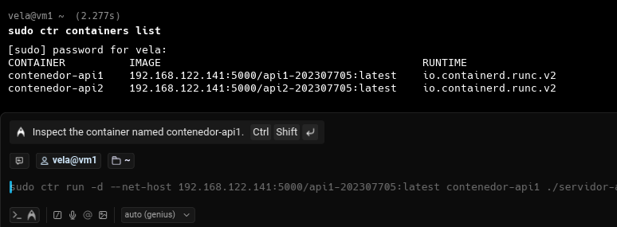

Terminal: VM2

Comando:
Comando:
```bash
sudo ctr containers list
```
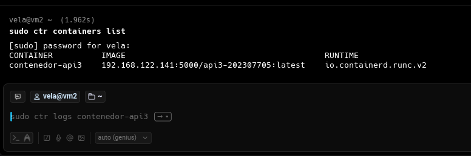


5. EVIDENCIA FUNCIONAL: Salud (Health Check)

Demuestra que cada API individualmente responde "estoy viva".

Terminal: PC Host

Comando (Prueba API1):
```bash
curl http://192.168.122.250:8080/health
```
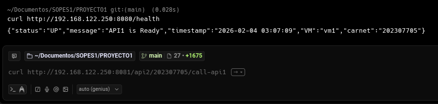


Comando (Prueba API2):
```bash
curl http://192.168.122.250:8081/health
```
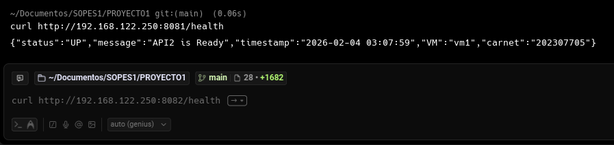

Comando (Prueba API3):
```bash
curl http://192.168.122.246:8080/health
```
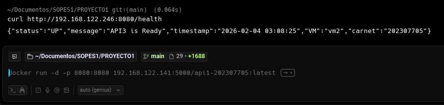

6. EVIDENCIA FUNCIONAL: Comunicación Cruzada (Éxito)
Se realizaron pruebas exhaustivas de todos los vectores de comunicación posibles para garantizar la interoperabilidad total de la malla de servicios.

Terminal para ejecutar los comandos: PC Host (Tu computadora).

6.1 Desde API1 (VM1 - Puerto 8080)
La API1 debe ser capaz de contactar a sus dos hermanas.

Caso A: API1 llama a API2 (Comunicación Local en VM1)
```bash
curl http://192.168.122.250:8080/api1/202307705/call-api2
```
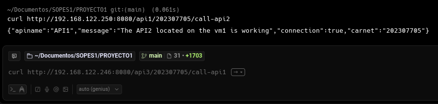

Caso B: API1 llama a API3 (Comunicación Remota hacia VM2)
```bash
curl http://192.168.122.250:8080/api1/202307705/call-api3
```


6.2 Desde API2 (VM1 - Puerto 8081)
La API2 debe ser capaz de contactar a sus dos hermanas.

Caso C: API2 llama a API1 (Comunicación Local en VM1)
```bash
curl http://192.168.122.250:8081/api2/202307705/call-api1
```
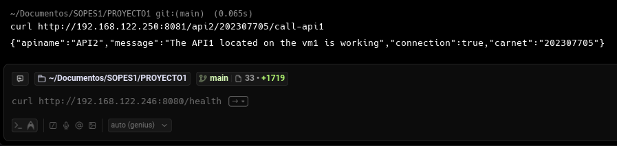

Caso D: API2 llama a API3 (Comunicación Remota hacia VM2)
```bash
curl http://192.168.122.250:8081/api2/202307705/call-api3
```


6.3 Desde API3 (VM2 - Puerto 8080)
La API3 debe ser capaz de "saltar" de servidor para contactar a las APIs de la VM1.

Caso E: API3 llama a API1 (Comunicación Remota hacia VM1)
```bash
curl http://192.168.122.246:8080/api3/202307705/call-api1
```


Caso F: API3 llama a API2 (Comunicación Remota hacia VM1)
```bash
curl http://192.168.122.246:8080/api3/202307705/call-api2
```
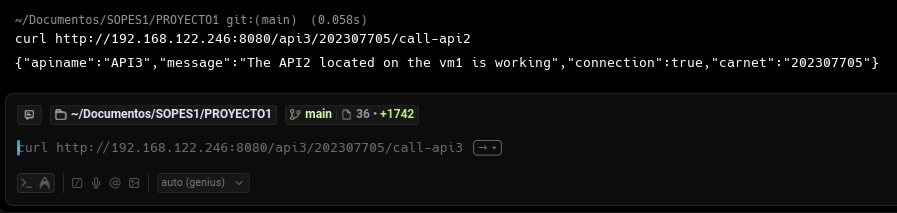

7. EVIDENCIA FUNCIONAL: Tolerancia a Fallos (Error)
Demuestra que tu sistema no explota cuando una API se cae.

Paso A: Matar a la víctima (API1)

Terminal: VM1

Comando:
```bash
sudo ctr tasks kill -s SIGKILL contenedor-api1
sudo ctr container delete contenedor-api1
```
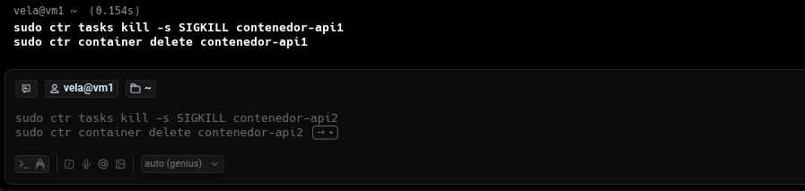

Paso B: Probar el error
Terminal: PC Host

Comando:
```bash
curl http://192.168.122.250:8081/api2/202307705/call-api1
```
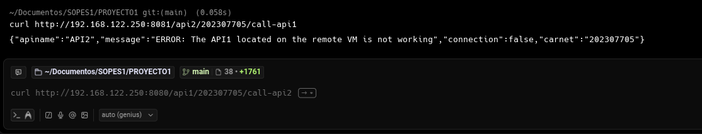


### 11 Comandos de Diagnóstico

**Verificar estado de servicios:**
```bash
# Docker
sudo systemctl status docker

# Containerd
sudo systemctl status containerd

# Ver logs de sistema
sudo journalctl -u containerd -f
```

**Verificar recursos:**
```bash
# Uso de CPU y memoria
top
htop

# Espacio en disco
df -h

# Procesos escuchando en puertos
sudo ss -tulpn | grep LISTEN
```

**Verificar red:**
```bash
# Tabla de rutas
ip route

# Interfaces de red
ip addr

# Conectividad
traceroute 192.168.122.141
telnet 192.168.122.141 5000
```

---

## 12. Conclusiones Técnicas

### 12.1 Logros del Proyecto

 **Virtualización Exitosa**: Se implementaron 3 VMs independientes sobre KVM/QEMU, simulando un entorno de producción distribuido.

**APIs Funcionales**: Las 3 APIs REST desarrolladas en Go cumplen al 100% con los requisitos del enunciado, incluyendo todos los endpoints especificados.

 **Comunicación Robusta**: Se validó la comunicación bidireccional entre todas las APIs con manejo apropiado de errores y timeouts.

 **Runtimes Heterogéneos**: Se demostró competencia en Docker (VM3) y Containerd (VM1, VM2), confirmando la portabilidad de OCI.

 **Registro Privado Funcional**: Zot Registry opera correctamente como repositorio centralizado de imágenes.

**Personalización Completa**: Todas las rutas, respuestas y nombres de imágenes incluyen el carnet (202307705) según lo solicitado.

## Anexos

### A. Comandos de Referencia Rápida

**Docker:**
```bash
docker build -t <image> .          # Construir imagen
docker run -d -p 8080:8080 <image> # Ejecutar contenedor
docker ps                          # Listar contenedores
docker logs <container>            # Ver logs
docker push <registry>/<image>     # Push a registry
```

**Containerd (ctr):**
```bash
sudo ctr images pull <image>               # Pull imagen
sudo ctr images list                       # Listar imágenes
sudo ctr run -d --net-host <image> <name>  # Ejecutar contenedor
sudo ctr tasks list                        # Listar tareas
sudo ctr tasks kill <name>                 # Detener contenedor
```

**Virsh:**
```bash
virsh list --all                   # Listar VMs
virsh start <vm>                   # Iniciar VM
virsh shutdown <vm>                # Apagar VM
virsh console <vm>                 # Conectar a consola
```


