# Manual Técnico
## Proyecto 2 - Sistemas Operativos 1

**Estudiante:** Josue David Velásquez Ixchop  
**Carnet:** 202307705

---

## 1. Introducción

El presente manual técnico describe la arquitectura, componentes, funcionamiento interno y lógica de operación del sistema desarrollado para el Proyecto 2 de Sistemas Operativos 1.

El sistema fue implementado con el objetivo de monitorear recursos del sistema operativo Linux y de procesos asociados a contenedores Docker, utilizando un módulo de kernel para la captura de información de bajo nivel y un daemon en Go para el análisis, almacenamiento y toma de decisiones.

---

## 2. Objetivo técnico del sistema

El sistema tiene como finalidad:

- Capturar información del sistema y procesos desde el kernel de Linux.
- Exponer dicha información mediante un archivo virtual en `/proc`.
- Procesar la información desde user space.
- Analizar consumo de CPU y memoria de procesos y contenedores.
- Identificar contenedores candidatos a eliminación.
- Aplicar políticas de protección y control sobre los contenedores.
- Almacenar resultados en archivo local y en Valkey.
- Proveer una base de integración con Grafana.

---

## 3. Arquitectura general del sistema

La arquitectura del sistema está compuesta por cinco bloques principales:

1. **Módulo de kernel en C**
2. **Archivo virtual `/proc`**
3. **Daemon en Go**
4. **Infraestructura Docker**
5. **Servicios auxiliares de almacenamiento y visualización**

El flujo general es el siguiente:

```text
Kernel Module (C)
        ↓
/proc/continfo_pr2_so1_202307705
        ↓
Daemon en Go
        ↓
Análisis de procesos y contenedores
        ↓
Logs JSON + Valkey
        ↓
Grafana
```

---

## 4. Estructura del proyecto

La estructura del proyecto se organizó de la siguiente manera:

```
PROYECTO2/
├── cron/
│   ├── spawn_containers.sh
│   └── cron.log
├── daemon/
│   ├── daemon
│   ├── go.mod
│   ├── main.go
│   └── monitor_logs.jsonl
├── grafana/
│   └── docker-compose.yml
└── kernel/
    ├── continfo.c
    ├── Makefile
    ├── continfo.ko
    ├── load_module.sh
    └── unload_module.sh
```

---

## 5. Módulo de kernel

### 5.1 Propósito

El módulo de kernel es responsable de recolectar métricas del sistema y de procesos directamente desde el kernel de Linux, y exponerlas a user space a través de un archivo en `/proc`.

### 5.2 Archivo generado en /proc

El módulo crea el archivo:

```
/proc/continfo_pr2_so1_202307705
```

Este archivo se genera al cargar el módulo con `insmod` y se elimina al descargarlo con `rmmod`.

### 5.3 Registro del archivo /proc

La creación del archivo se realiza mediante funciones del subsistema `procfs`:

- `proc_create`
- `proc_remove`
- `single_open`
- `seq_read`
- `seq_lseek`
- `single_release`

El uso de `proc_ops` asegura compatibilidad con versiones recientes del kernel.

### 5.4 Función principal del módulo

La función principal del módulo recorre procesos del sistema y genera el contenido del archivo `/proc`.

Se utiliza:

- `si_meminfo()` para obtener información global de memoria.
- `for_each_process(task)` para recorrer todos los procesos.
- `task->mm` para identificar procesos con memoria de usuario.
- `get_mm_rss(task->mm)` para obtener RSS.
- `task->mm->total_vm` para obtener VSZ.
- `task->utime + task->stime` para obtener tiempo acumulado de CPU.

---

## 6. Métricas obtenidas por el módulo

El módulo expone las siguientes métricas del sistema:

- RAM total
- RAM libre
- RAM usada

Y para cada proceso:

- PID
- PPID
- Nombre del proceso
- VSZ en KB
- RSS en KB
- Porcentaje de memoria
- Tiempo acumulado de CPU

### 6.1 Cálculo de RAM

Se obtiene mediante `i.totalram`, `i.freeram` e `i.mem_unit`.

El cálculo en KB se realiza de la forma:

```
RAM_TOTAL_KB = (totalram * mem_unit) / 1024
RAM_FREE_KB  = (freeram * mem_unit) / 1024
RAM_USED_KB  = RAM_TOTAL_KB - RAM_FREE_KB
```

### 6.2 Cálculo de VSZ

El VSZ se calcula a partir de `total_vm`:

```
VSZ_KB = (task->mm->total_vm * PAGE_SIZE) / 1024
```

### 6.3 Cálculo de RSS

El RSS se calcula mediante:

```
RSS_KB = (get_mm_rss(task->mm) * PAGE_SIZE) / 1024
```

### 6.4 Cálculo del porcentaje de memoria

El porcentaje de memoria se calculó de forma entera:

```
MEM_PCT = (RSS_KB * 100) / RAM_TOTAL_KB
```

### 6.5 Cálculo del tiempo de CPU

El valor registrado es tiempo acumulado y no porcentaje instantáneo:

```
CPU_TIME = task->utime + task->stime
```

Este valor fue utilizado posteriormente por el daemon para calcular variaciones entre dos muestras.

---

## 7. Formato de salida del archivo /proc

Inicialmente se realizaron pruebas con un formato orientado a lectura humana. Posteriormente, se adoptó un formato estructurado para simplificar el parseo en Go.

El formato final del archivo `/proc` es:

```
RAM_TOTAL_KB:<valor>
RAM_FREE_KB:<valor>
RAM_USED_KB:<valor>
PROC:PID|PPID|NOMBRE|VSZ_KB|RSS_KB|MEM_PCT|CPU_TIME
```

Ejemplo:

```
RAM_TOTAL_KB:32637804
RAM_FREE_KB:19478036
RAM_USED_KB:13159768
PROC:1|0|systemd|23980|14780|0|9081000000
PROC:4705|4298|brave|1461596860|876584|2|1032534000000
```

Este formato permite separar fácilmente las líneas de memoria global y las líneas de procesos.

---

## 8. Compilación del módulo

La compilación del módulo se realiza mediante un `Makefile` compatible con el sistema de construcción del kernel.

Comando principal:

```bash
make -C /lib/modules/$(uname -r)/build M=$(PWD) modules
```

El archivo generado es `continfo.ko`.

---

## 9. Daemon en Go

### 9.1 Propósito

El daemon en Go es responsable de:

- Leer el archivo `/proc`.
- Parsear el contenido estructurado.
- Realizar análisis de procesos.
- Detectar variaciones de CPU entre muestras.
- Relacionar procesos con contenedores Docker.
- Determinar candidatos a eliminación.
- Aplicar políticas de eliminación.
- Registrar resultados en JSON y Valkey.

### 9.2 Lectura del archivo /proc

La lectura se realiza utilizando `os.Open` y `bufio.Scanner`.

Cada línea es procesada por una función de parseo que identifica si corresponde a:

- `RAM_TOTAL_KB`
- `RAM_FREE_KB`
- `RAM_USED_KB`
- `PROC:...`

### 9.3 Estructuras utilizadas

Se definieron estructuras para modelar la información:

- `ProcessInfo`
- `SystemInfo`
- `CPUResult`
- `DockerContainer`
- `ContainerCandidate`
- `CycleLog`

Estas estructuras permiten representar de forma clara la información del sistema, del análisis y de las decisiones tomadas.

---

## 10. Análisis por muestras

### 10.1 Primera muestra

El daemon realiza una primera lectura del archivo `/proc`.

### 10.2 Intervalo de espera

Se espera un intervalo de tiempo fijo entre muestras.

### 10.3 Segunda muestra

Se realiza una segunda lectura del archivo `/proc`.

### 10.4 Cálculo de delta CPU

El valor de CPU registrado por el módulo es acumulado, por lo que para obtener actividad reciente se calcula la diferencia entre la segunda y la primera muestra:

```
DELTA_CPU = CPU_TIME_SEGUNDA_MUESTRA - CPU_TIME_PRIMERA_MUESTRA
```

Este valor permite identificar procesos que tuvieron mayor actividad durante el intervalo.

---

## 11. Ordenamiento de procesos

El daemon implementa dos tipos principales de ordenamiento:

### 11.1 Top por RSS

Los procesos se ordenan por mayor uso de memoria residente (RSS).

### 11.2 Top por delta CPU

Los procesos se ordenan por mayor incremento de CPU entre muestras.

Este análisis permite determinar procesos pesados tanto por memoria como por CPU.

---

## 12. Integración con Docker

### 12.1 Propósito

El daemon necesita mapear procesos del host con contenedores Docker, debido a que el módulo del kernel observa procesos reales del sistema y no nombres de contenedores directamente.

### 12.2 Obtención de contenedores activos

Se utiliza el comando:

```bash
docker ps --format "{{.ID}}|{{.Names}}|{{.Image}}"
```

Para cada contenedor activo se obtiene:

- ID
- Nombre
- Imagen

### 12.3 Obtención del PID principal del contenedor

Posteriormente se ejecuta:

```bash
docker inspect -f "{{.State.Pid}}" <container_id>
```

Con esto se obtiene el PID principal del contenedor en el host.

### 12.4 Mapeo PID ↔ contenedor

El daemon construye una estructura donde la clave es el PID del contenedor y el valor es el contenedor correspondiente.

Esto permite asociar candidatos detectados por consumo con nombres reales de contenedores.

---

## 13. Generación de carga con contenedores

Para probar el sistema se implementó un script de generación de carga denominado `spawn_containers.sh`.

### 13.1 Tipos de contenedores creados

| Nombre | Tipo de carga |
|--------|---------------|
| `low_1`, `low_2`, `low_3` | Bajo consumo |
| `highcpu_1`, `highcpu_2` | Alto consumo de CPU |
| `highram_1` | Alto consumo de RAM |

### 13.2 Comportamiento

- Los contenedores `low_*` ejecutan `sleep`.
- Los contenedores `highcpu_*` ejecutan un `while true`.
- El contenedor `highram_1` reserva memoria utilizando Python.

### 13.3 Objetivo del script

Este script permite generar escenarios controlados de carga sobre CPU y RAM para validar el comportamiento del daemon y de la política de eliminación.

---

## 14. Cronjob

Se configuró un cronjob para ejecutar automáticamente el script de generación de contenedores.

Línea utilizada:

```
*/2 * * * * /home/vela/Documentos/SOPES1/PROYECTO2/cron/spawn_containers.sh >> /home/vela/Documentos/SOPES1/PROYECTO2/cron/cron.log 2>&1
```

### 14.1 Función

El cronjob:

- Limpia contenedores anteriores.
- Recrea contenedores de prueba.
- Registra la salida en `cron.log`.

Esto automatiza la generación de carga para pruebas repetitivas.

---

## 15. Política de candidatos

### 15.1 Detección inicial

Se identifican procesos con mayor `DELTA_CPU` y se filtran procesos protegidos.

### 15.2 Candidatos por contenedor

Se transforman procesos candidatos en contenedores candidatos utilizando el mapeo PID ↔ contenedor.

### 15.3 Contenedores protegidos

El sistema protege explícitamente:

- `grafana_so1`
- `valkey_so1`
- `low_*`

### 15.4 Priorización

La política prioriza:

1. `highcpu_*`
2. `highram_*`

### 15.5 Motivos registrados

Cada contenedor candidato recibe un motivo:

- `high_cpu`
- `high_ram`

---

## 16. Política de eliminación

La lógica final de eliminación implementa las siguientes reglas:

- No eliminar contenedores `low_*`.
- No eliminar `grafana_so1`.
- No eliminar `valkey_so1`.
- Si existen más de dos contenedores `high`, eliminar el primero según prioridad.
- Si ya solo quedan dos contenedores `high`, no eliminar más.

### 16.1 Conteo de contenedores high

Se consideran contenedores `high` aquellos cuyos nombres empiezan con:

- `highcpu_`
- `highram_`

### 16.2 Restricción mínima

Si el número de contenedores `high` es menor o igual a 2, la eliminación se bloquea.

### 16.3 Ejemplo de comportamiento

Caso de eliminación:

```
Contenedores high activos: 3
Eliminando contenedor candidato: highcpu_2 (motivo: high_cpu)
Contenedor eliminado correctamente: highcpu_2
```

Caso de protección:

```
Contenedores high activos: 2
No se elimina highcpu_1 porque ya solo quedan 2 contenedores high
```

---

## 17. Registro de eventos

### 17.1 Log local

El daemon almacena cada ciclo en `monitor_logs.jsonl`. Cada línea es un objeto JSON independiente.

### 17.2 Información registrada

Cada ciclo guarda:

- `timestamp`
- RAM total, libre y usada
- Top 5 por RSS
- Top 5 por delta CPU
- Contenedor candidato
- Motivo
- Acción tomada

Campos adicionales:

- `deleted_container`
- `deleted_reason`
- `action_taken`

### 17.3 Acciones posibles

Las acciones registradas incluyen:

| Acción | Descripción |
|--------|-------------|
| `removed` | Contenedor eliminado correctamente. |
| `skipped_min_high_limit` | No se eliminó por restricción mínima. |
| `no_candidates` | No se encontraron candidatos. |
| `remove_error` | Error al intentar eliminar. |
| `skipped_invalid_target` | Objetivo inválido o protegido. |

---

## 18. Integración con Valkey

### 18.1 Propósito

Valkey se utiliza como almacenamiento de métricas y eventos del sistema.

### 18.2 Datos guardados

Se registran los ciclos completos en la lista `monitor:logs`.

Además, se almacenan métricas individuales:

- `monitor:ram_total`
- `monitor:ram_free`
- `monitor:ram_used`
- `monitor:last_update`
- `monitor:top_rss`
- `monitor:top_cpu`

### 18.3 Beneficios

Esto permite:

- Persistir resultados de ejecución.
- Facilitar la consulta posterior.
- Integrar datos con otras herramientas.

---

## 19. Integración con Grafana

Grafana se levantó como parte de la infraestructura del sistema para disponer de una plataforma de visualización.

Se accede mediante: [http://localhost:3000](http://localhost:3000)

En esta implementación, Grafana se encuentra listo como base de visualización del sistema, mientras que las métricas se almacenan en Valkey para uso posterior.

---

## 20. Resultados observados en pruebas

Durante las pruebas se validó que:

- El módulo crea correctamente el archivo `/proc`.
- El daemon lee y parsea la información correctamente.
- Los contenedores `highcpu_*` presentan valores muy altos de `DELTA_CPU`.
- El contenedor `highram_1` presenta un alto valor de `RSS`.
- Los contenedores `low_*` se mantienen con bajo consumo.
- El daemon identifica correctamente candidatos a eliminación.
- El daemon elimina correctamente un contenedor `high` cuando corresponde.
- El daemon respeta el mínimo de dos contenedores `high`.

---

## 21. Ventajas técnicas de la solución

- Integración entre kernel space y user space.
- Captura de métricas directamente desde el kernel.
- Formato estructurado para análisis automatizado.
- Uso de Docker para simulación controlada de carga.
- Uso de Go para análisis eficiente y modular.
- Persistencia local y remota de eventos.
- Política de eliminación con restricciones explícitas.

---

## 22. Limitaciones actuales

- El campo `CPU_TIME` es una medida acumulada, no porcentaje instantáneo.
- El porcentaje de memoria se calcula de forma entera, por lo que procesos pequeños pueden aparecer con `0`.
- La visualización en Grafana quedó como infraestructura lista, pero no se desarrolló un dashboard completo dentro de este alcance.
- La identificación de contenedores depende del PID principal del contenedor.

---

## 23. Recomendaciones técnicas futuras

- Implementar un cálculo más preciso de `%CPU`.
- Refinar el cálculo de `%MEM` con mayor precisión decimal.
- Registrar métricas históricas más detalladas.
- Integrar un dashboard completo de Grafana.
- Expandir la política de eliminación según umbrales configurables.
- Implementar restauración o recreación automática de contenedores según política.

---

## 24. Conclusión

El sistema desarrollado demuestra la integración efectiva entre un módulo de kernel en C y un daemon en Go para monitoreo y control básico de cargas generadas mediante contenedores Docker.

La solución permite capturar métricas del sistema desde el kernel, analizarlas en user space, relacionarlas con contenedores reales, aplicar políticas de eliminación y registrar resultados tanto localmente como en Valkey.

Desde el punto de vista técnico, el sistema cumple con la meta de combinar monitoreo, análisis y acción automatizada en un entorno Linux.

> El módulo del kernel registra un valor acumulado de tiempo de CPU por proceso (`CPU_TIME_RAW`). El daemon en Go toma dos muestras consecutivas y calcula `CPU_DELTA`, que representa la variación del consumo de CPU entre ambas lecturas. Esta métrica se utilizó como aproximación práctica del uso de CPU para priorizar procesos y contenedores candidatos, en concordancia con el enunciado, que permite mantener valores diferenciales grandes cuando así los retorna el kernel.

## Evidencias
### Fase 1: El Módulo de C
#### Paso 1: La Compilación
Navega a la carpeta donde tienes tu código en C (la de la sonda) y ejecuta:

```bash
make clean
make
```
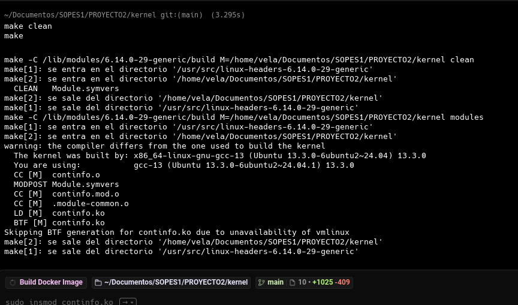

#### Paso 2: Cargar el Módulo y leer /proc

Ahí mismo en la terminal, inyecta el módulo (cambia el nombre del .ko por el tuyo si es distinto) y luego lee el archivo generado:

```bash
sudo insmod modulo_so1.ko
cat /proc/continfo_pr2_so1_202307705
```

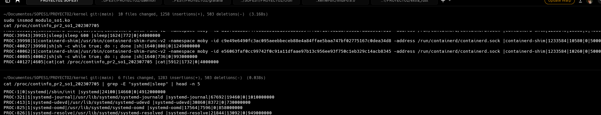

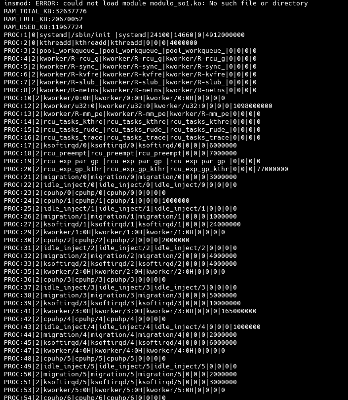

#### Paso 3: Descargar el Módulo limpiamente

Ahora sácalo del sistema y revisa los logs para demostrar que no rompió nada:

```bash
sudo rmmod modulo_so1
dmesg | tail -n 5
```

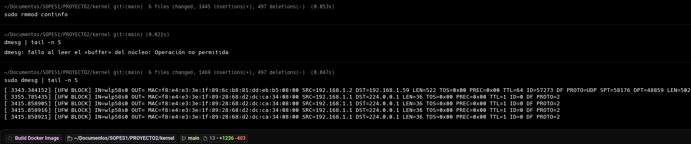
### Fase 2 : Servicios del Daemon

#### Paso 1: Levantar la Infraestructura (Docker)
Primero, navega a tu carpeta de Grafana y levanta los servicios:

```bash
cd ~/Documentos/SOPES1/PROYECTO2/grafana
docker compose up -d
docker ps
```

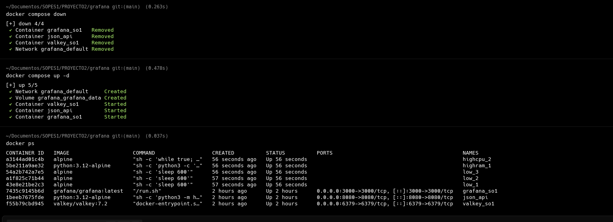

#### Paso 2: Arrancar el Daemon (Go)
Ahora, vamos a encender el cerebro de la operación. Ve a tu carpeta del daemon:


```bash
go build -o daemon
sudo ./daemon
```

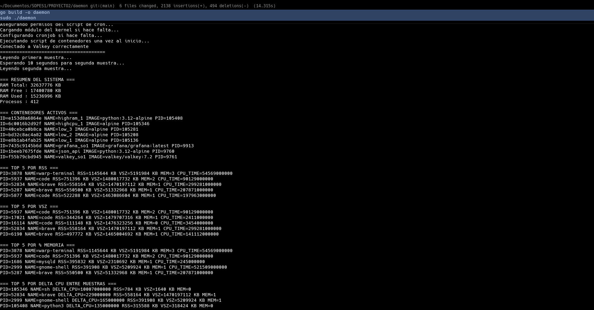

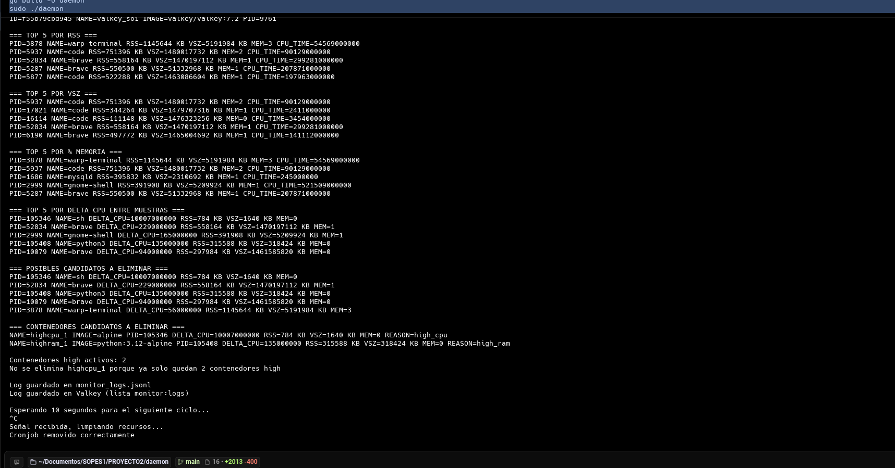

#### Paso 3: Validar el Cronjob
Mientras el Daemon de Go sigue corriendo en la terminal anterior, abre una nueva pestaña o ventana de terminal.
Ejecuta esto para comprobar que Go configuró la tarea programada:

```bash
crontab -l
```

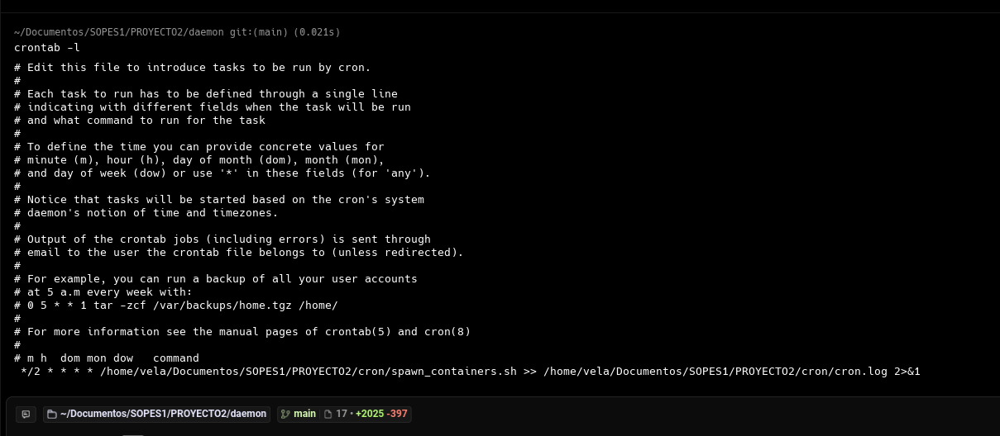

### Fase 3: Reglas de Negocio y Limpieza (Terminación del Servicio)
#### Paso 1: Demostrar las reglas de contenedores
Mientras tu Daemon de Go sigue corriendo (y el cronjob está ejecutando tu script spawn_containers.sh), abre una terminal y revisa los contenedores vivos:

```bash
docker ps
```

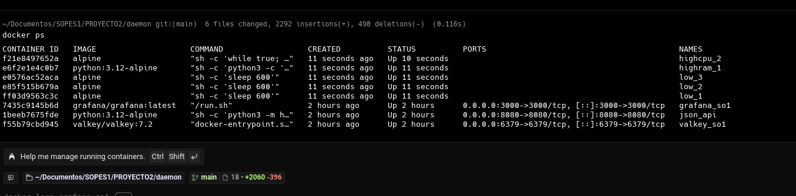

### Paso 2: Finalización Limpia del Daemon
El enunciado pide explícitamente que al detener el servicio, se debe limpiar el cronjob.

Ve a la terminal donde está corriendo tu Daemon en Go.

Presiona Ctrl + C para detener el programa.

Ahora, ejecuta de nuevo:

```bash
sudo crontab -l
```

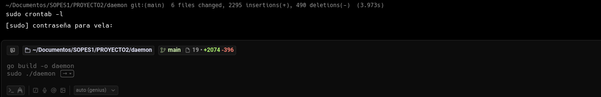

### Fase 4: El Dashboard de Grafana
Paso 1: La Visualización Final

Abre tu navegador web y entra a http://localhost:3000.

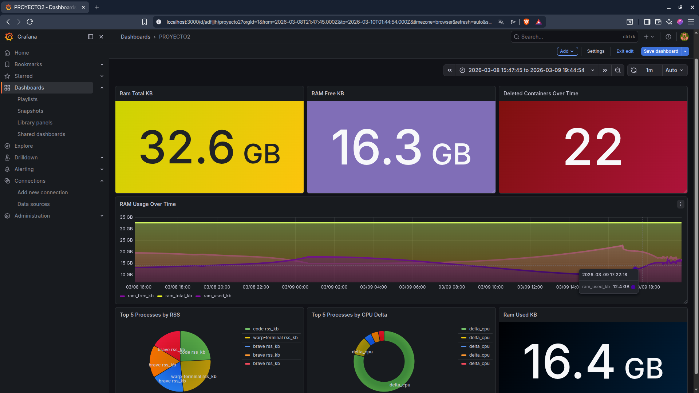